**mitmproxy**是一个代理工具（类似于Charles），可以实现抓包的功能。除此以外，他还可以集成Python脚本，在请求和响应中用代码进行自定义操作。


# 1.安装和报错

基于 Python3.9.10 解释器创建了个虚拟环境，然后在虚拟环境中安装 `mitmproxy`

```
pip install mitmproxy
```

报错信息：

```
return _msvc14_get_vc_env(plat_spec)
File "E:\PycharmProjects\mitmproxy_example\.venv\lib\site-packages\setuptools\msvc.py", line 270, in _msvc14_get_vc_env
raise distutils.errors.DistutilsPlatformError(
setuptools._distutils.errors.DistutilsPlatformError: Microsoft Visual C++ 14.0 or greater is required. Get it with "Microsoft C++ Build Tools": https://visualstudio.mi
crosoft.com/visual-cpp-build-tools/
```

需要去下载`Visual C++ Build Tools for Visual Studio 2015`安装到电脑，然后再重新 `pip install mitmproxy` 才行。

https://my.visualstudio.com/Downloads?q=Visual%20Studio%202015%20update%203

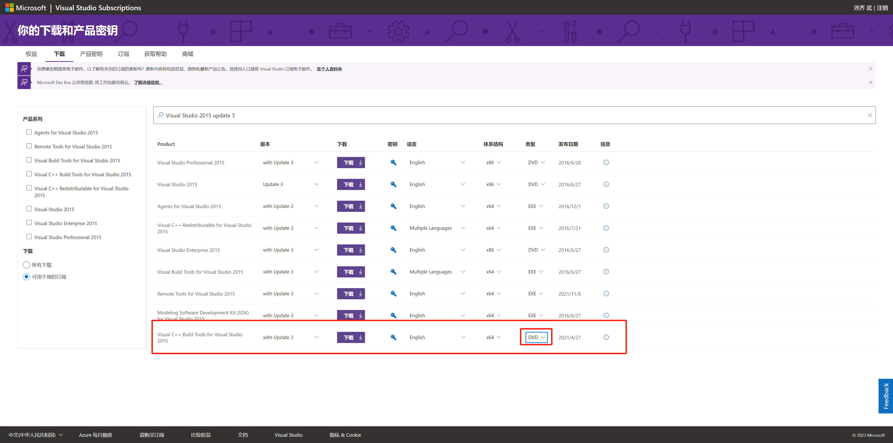


解压 `mu_visual_cpp_build_tools_2015_update_3_x64_dvd_dfd9a39c.iso`文件，然后默认安装。


再次安装成功：

```
pip install mitmproxy
```

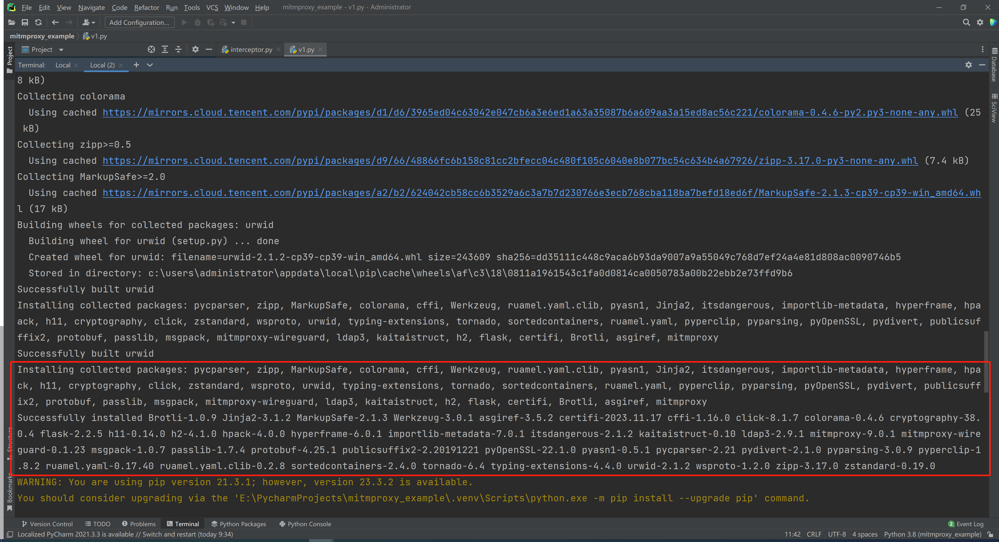

# 2.Https请求

默认只能抓取http请求包，想要支持**https**请求，就需要安装证书。


## 2.1 启动

常见的启动方式：

### mitmweb

```
mitmweb -p 9888
```

网页版，提供一个类似于Charles抓包的页面。


### mitmproxy（不推荐）

```
mitmproxy -p 9888
```

在终端命令行，显示请求和数据。


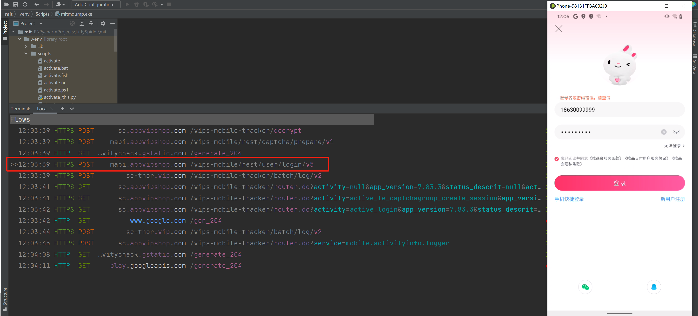

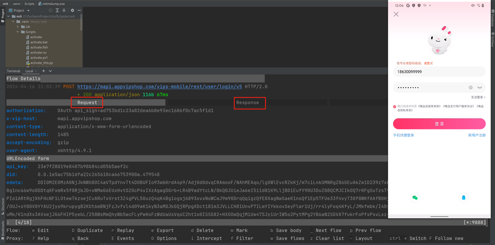


### mitmdump

```
mitmdump  -p 9888
```


## 2.2 关闭电脑防火墙

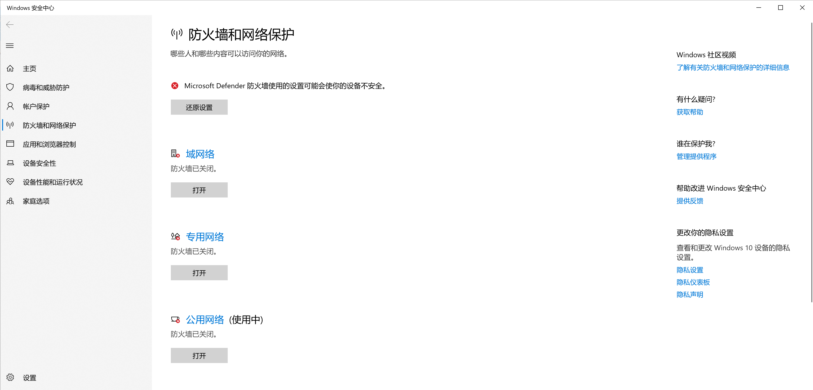


## 2.3 手机系统代理


## 2.4 下载安装证书


## 2.5 抓包测试

案例：唯品会v7.83.3


案例：京东v12.6.0

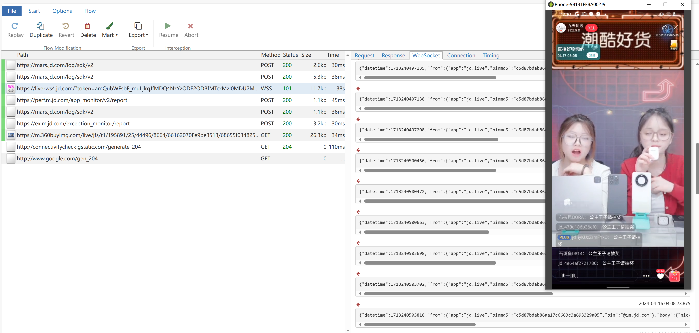


# 3.集成Python脚本


## 3.1 读取请求

```
>>>mitmdump -q  -p 9888 -s v1.py
```

```python
from mitmproxy import http
from mitmproxy.http import Request


def request(flow):
    print("请求-->", flow.request.url)
    print("请求-->", flow.request.host)
    print("请求-->", flow.request.path)
    print("请求-->", flow.request.query)
    print("请求-->", flow.request.cookies)
    print("请求-->", flow.request.headers)
    print("请求-->", flow.request.method)
    print("请求-->", flow.request.content)
```

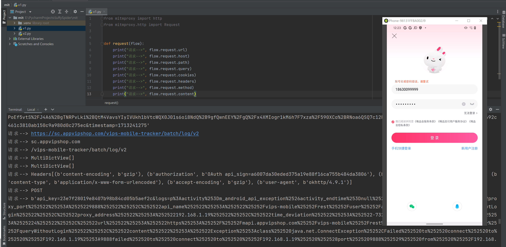


## 3.2 修改请求

```
>>>mitmdump -q  -p 9888 -s v2.py
>>>mitmweb -q  -p 9888 -s v2.py 
```

```python
from mitmproxy import http
from mitmproxy.http import Request
from mitmproxy.http import HTTPFlow


def request(flow: HTTPFlow):
    print('-' * 60)
    print(flow.request.url)
    flow.request.query['mine'] = 'wupeiqi'
    flow.request.cookies["token"] = "40c31b0d89c0299458ef44e09e379cb3"
    flow.request.headers['info'] = "wupeiqi"
    # flow.request.cookies = [
    #     ("token","40c31b0d89c0299458ef44e09e379cb3")
    # ]
```

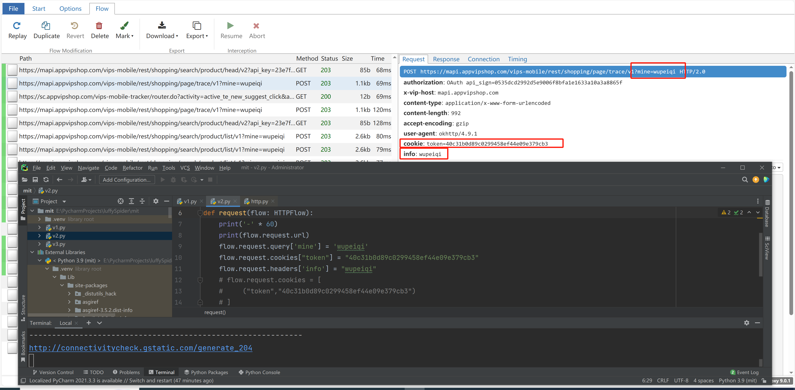

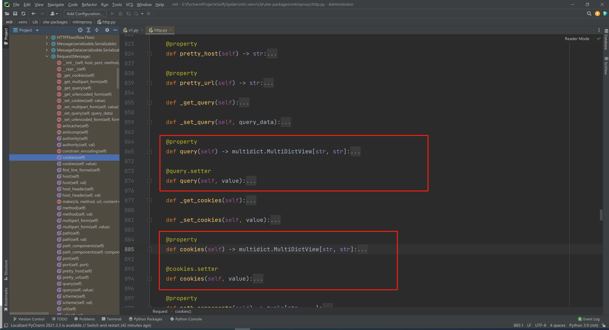


## 3.3 拦截请求

```python
from mitmproxy import http
from mitmproxy.http import Request
from mitmproxy.http import HTTPFlow
from mitmproxy.http import Response


def request(flow: HTTPFlow):
    if flow.request.url.startswith("https://www.5xclass.cn/"):
        # 设置返回值
        flow.response = Response.make(
            200,  # (optional) status code
            b"Hello World",  # (optional) content
            {"Content-Type": "text/html"}  # (optional) headers
        )
```

```python
from mitmproxy import http
from mitmproxy.http import Request
from mitmproxy.http import HTTPFlow


def request(flow: HTTPFlow):
    if flow.request.url.startswith("https://www.5xclass.cn/"):
        flow.kill()
```


## 案例：账号共享（油联）

> 版本：油联合伙人v1.4


先正常登录 APP 或 网页 ，获取对应的凭证信息，然后再在其他请求中携带过去。

```
461cc0cab38d4c41a148820a46c2820c1713252333598
```


```python
from mitmproxy.http import HTTPFlow


def request(flow: HTTPFlow):
    print(flow.request.url)
    # flow.request.headers.add("X-Token","461cc0cab38d4c41a148820a46c2820c1713252333598")
    flow.request.headers["X-Token"] = "461cc0cab38d4c41a148820a46c2820c1713252333598"

```

```
>>>mitmweb -q  -p 9888 -s v4.py
>>>mitmdump -q  -p 9888 -s v4.py
```

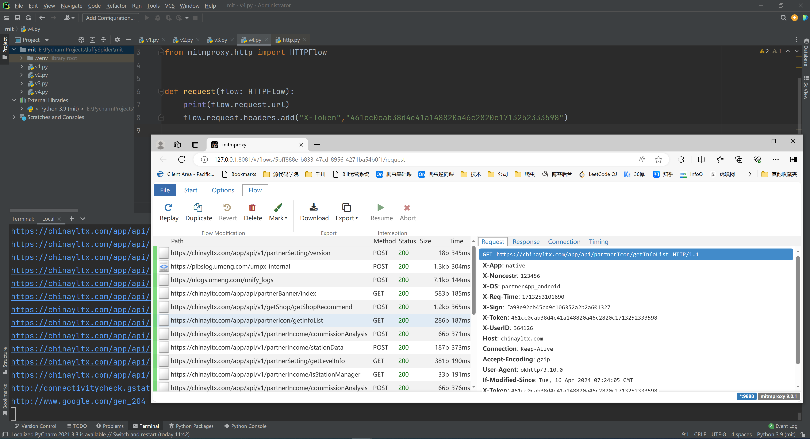


## 3.4 响应内容

```python
from mitmproxy import http
from mitmproxy.http import Request
from mitmproxy.http import HTTPFlow
from mitmproxy.http import Response


def response(flow: http.HTTPFlow):
    print(flow.request.url)
    
    print(flow.response.status_code)
    print(flow.response.cookies)
    print(flow.response.headers)
    print(flow.response.content)

# mitmdump -q  -p 9888 -s v5.py
```

## 3.5 修改响应

```python
from mitmproxy import http
from mitmproxy.http import Request
from mitmproxy.http import HTTPFlow
from mitmproxy.http import Response


def response(flow: http.HTTPFlow):
    print(flow.request.url)
    print(flow.response.status_code)
    print(flow.response.cookies)
    print(flow.response.headers)
    # print(flow.response.content)
    
    flow.response = Response.make(
        200,  # (optional) status code
        b"Hello World",  # (optional) content
        {"Content-Type": "text/html"}  # (optional) headers
    )
    
# mitmdump -q  -p 9888 -s v5.py
```


## 案例：采集评论（汽车之家）

> 版本：汽车之家v11.60.5

人工操作手机，代码自动将评论保存起来。

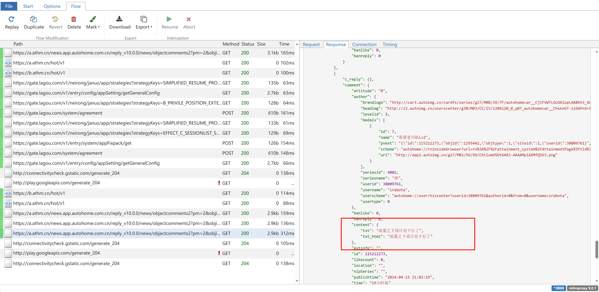

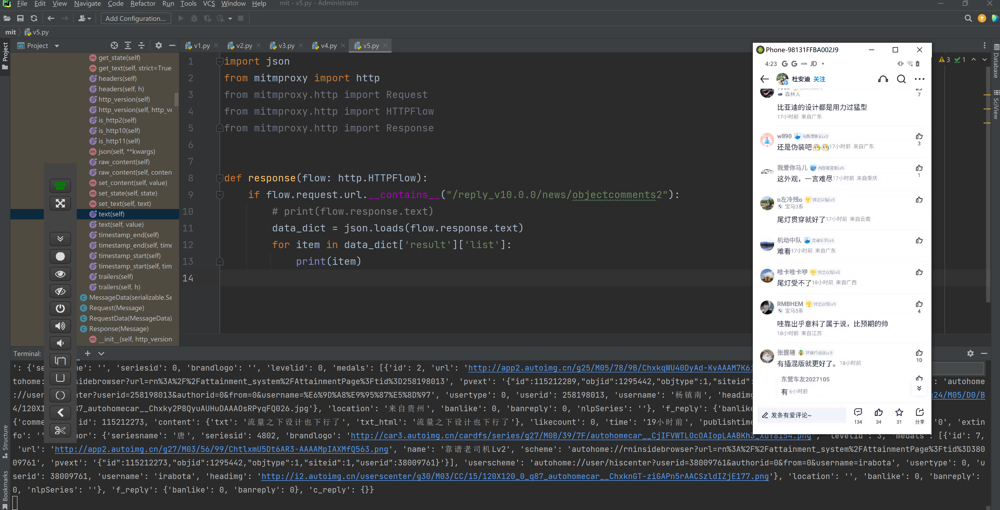


```python
import json
from mitmproxy import http
from mitmproxy.http import Request
from mitmproxy.http import HTTPFlow
from mitmproxy.http import Response


def response(flow: http.HTTPFlow):
    if flow.request.url.__contains__("/reply_v10.0.0/news/objectcomments2"):
        # print(flow.response.text)
        data_dict = json.loads(flow.response.text)
        for item in data_dict['result']['list']:
            print(item)
            
# mitmweb -q  -p 9888 -s v5.py
```


## 3.6 websocket

> 案例：京东v12.6.0

```python
from mitmproxy import http

def websocket_start(flow: http.HTTPFlow):
    pass

def websocket_message(flow: http.HTTPFlow):
    message = flow.websocket.messages[-1]

    if message.from_client:
        print(f"客户端发送: {message.text}")
    else:
        print(f"服务端发送: {message.text}")
	
    # manipulate the message content
    # message.content = b"hello"
    
    # kill the message and not send it to the other endpoint
    # message.drop()
    
def websocket_end(flow: http.HTTPFlow):
    pass
```


## 案例：抖音弹幕（web抖音）

> Web版抖音直播间的弹幕信息，是基于：WebSocket + Protobuf协议实现。
>
> ```
> pip install protobuf==4.24.2
> ```
>
> Protobuf和抖音弹幕相关相关：https://www.bilibili.com/video/BV17A411Q7eZ?p=2


```
mitmweb -q  -p 9888 -s v6.py
```

```python
import gzip
from mitmproxy import http
from douyin_pb2 import PushFrame, Response, ChatMessage, MemberMessage


def websocket_start(flow: http.HTTPFlow):
    pass


def websocket_message(flow: http.HTTPFlow):
    message = flow.websocket.messages[-1]

    if message.from_client:
        # print(f"客户端发送: {message.content}")
        pass
    else:
        # print(f"服务端发送: {message.content}")
        frame = PushFrame()
        frame.ParseFromString(message.content)
        # 对PushFrame的 payload 内容进行gzip解压
        origin_bytes = gzip.decompress(frame.payload)

        # 根据Response+gzip解压数据，生成数据对象
        response = Response()
        response.ParseFromString(origin_bytes)

        # 获取数据内容（需根据不同method，使用不同的结构对象对 数据 进行解析）
        #   注意：此处只处理 WebcastChatMessage ，其他处理方式都是类似的。
        for item in response.messagesList:

            # if item.method == "WebcastMemberMessage":
            #     message = MemberMessage()
            #     message.ParseFromString(item.payload)
            #     print(message)

            if item.method == "WebcastChatMessage":
                message = ChatMessage()
                message.ParseFromString(item.payload)
                # print(message)
                info = f"【{message.user.id}】{message.user.shortId} {message.user.nickName}】{message.content} "
                print(info)
                print("-" * 50)


def websocket_end(flow: http.HTTPFlow):
    pass
```

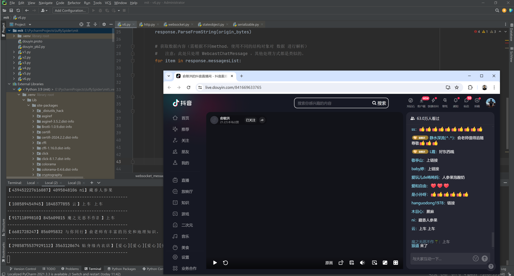


# 4.抓包-电脑端

想要使用mitmproxy在电脑端进行抓包，也需要在电脑上安装https证书。

## 4.1 启动

**同2.1**需要先启动mitmproxy

```
mitmweb -p 9888
mitmproxy -p 9888
mitmdump  -p 9888
```


## 4.2 下载证书

**方式1：**当启动mitmproxy之后，可以在电脑本地读取证书。


**方式2：**配置代理，然后下载证书。

在电脑上配置mitmproxy为代理，访问 `http://mitm.it/`下载证书。

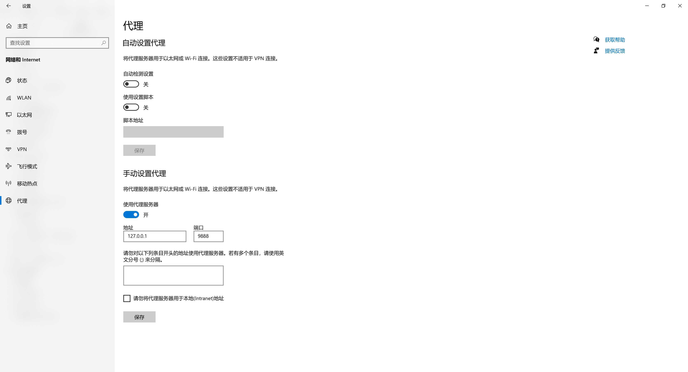

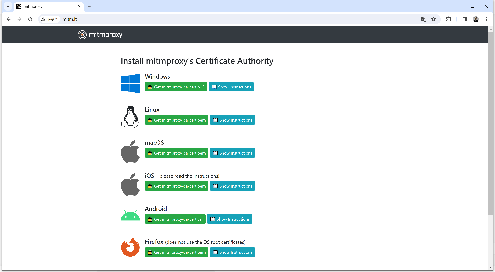


## 4.3 安装证书


## 4.4 配置代理 & 抓包


